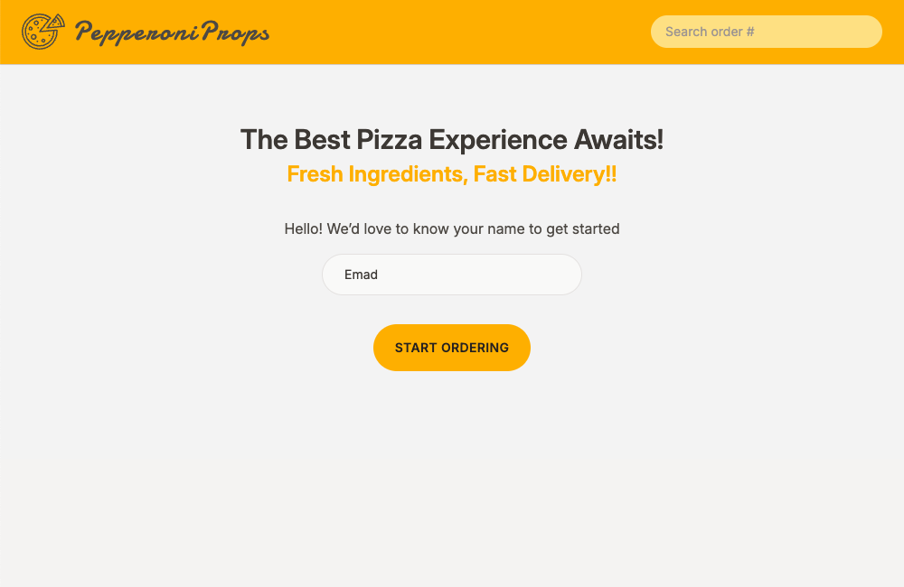
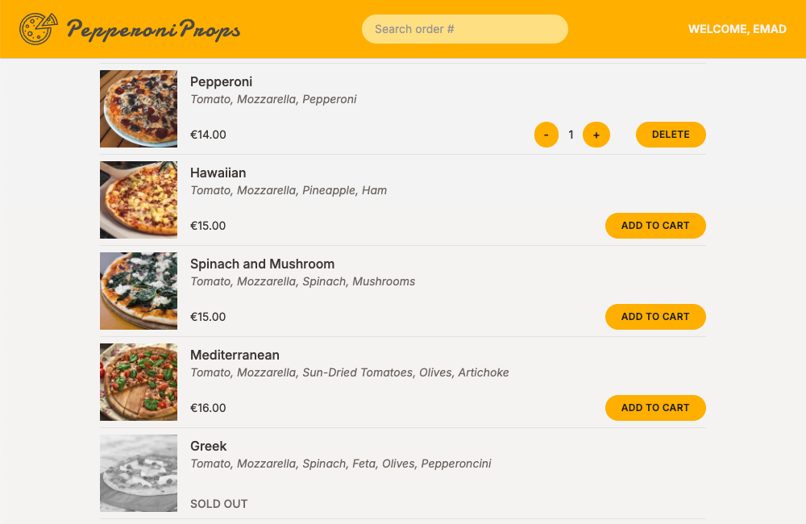
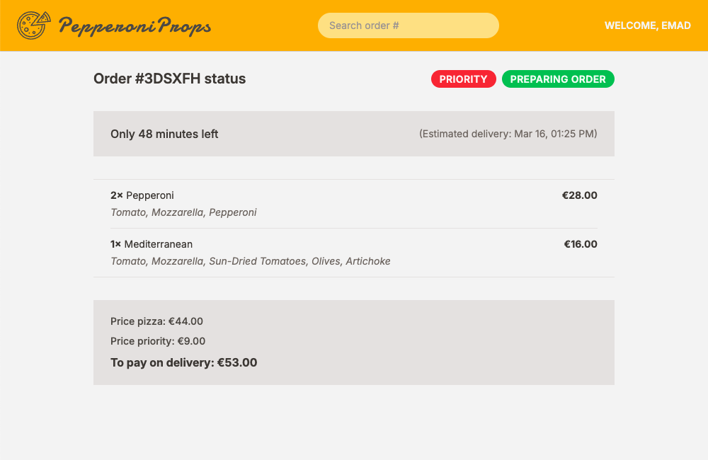

# 🍕 PepperoniProps

PepperoniProps is a modern pizza ordering app built with React, TypeScript, Redux Toolkit, and React Router. It provides a smooth and interactive user experience, allowing customers to browse the menu, add items to the cart, place orders, and track them in real-time.

## 🖼️ Screenshots

### 📌 Home Screen

### 📌 Menu Screen

### 📌 Order Screen

## 🚀 Features

- 📜 **Browse Menu** – View a selection of delicious pizzas with detailed descriptions.
- 🛒 **Cart Management** – Add, remove, and update items seamlessly.
- 📦 **Order Tracking** – Track orders with unique order IDs.
- 🔥 **Priority Orders** – Mark an order as priority for faster processing.
- 💾 **Persistent State** – Redux Toolkit ensures data consistency.
- ⚡ **Optimized Performance** – Uses lazy loading and error boundaries.
- 🎨 **Modern UI** – Styled with Tailwind CSS for a sleek and responsive design.
- 🧪 **Test Coverage** – Components, Redux slices, and services covered with unit and integration tests.

## 🛠️ Tools & Technologies

- ⚛️ **React** – Component-based UI development.
- 🟦 **TypeScript** – Static typing for better reliability.
- 🏗 **Redux Toolkit** – Simplified and scalable state management.
- 🚦 **React Router** – Seamless navigation between pages.
- 🎨 **Tailwind CSS** – Utility-first styling for a polished UI.
- 🧪 **Vitest & React Testing Library** – Reliable and fast testing setup for components and business logic.

## 🔗 Live Demo

- 🌍 [Try PepperoniProps Now!](https://pepperoniprops-emadabaei.vercel.app)

## 🧪 Testing

The app includes a growing test suite covering core components, Redux logic, and service functions to ensure stability and reliability.

- 🔍 **React Testing Library** for user-centric unit and integration testing.
- ⚡ **Vitest** as a fast, Vite-native testing framework.
- 🧪 All tests are colocated under a dedicated `/tests` folder, mirroring the app structure.
- 🛠 Integration and end-to-end tests planned for future development.

⏺️ To run tests:
npm run test

## 📂 Setup & Installation

1️⃣ Clone the repository:
git clone https://github.com/emad-abaei/PepperoniProps.git

2️⃣ Navigate to the project directory:
cd PepperoniProps

3️⃣ Install dependencies:
npm install

4️⃣ Run the development server:
npm run dev

## 🙌 Acknowledgments

This project was originally inspired by a course from **Jonas Schmedtmann**. While the core idea comes from the course, I have made some enhancements, including:

✅ **Migrating from JavaScript to TypeScript** for better type safety and maintainability.

✅ **Refactoring and optimizing the codebase** for cleaner, more efficient development.

✅ **Implemented a modern testing setup** using Vitest and Testing Library for confidence and maintainability.

## 📩 Contributing

Contributions are welcome! Feel free to submit issues.

## 📜 License

This project is licensed under the MIT License.
